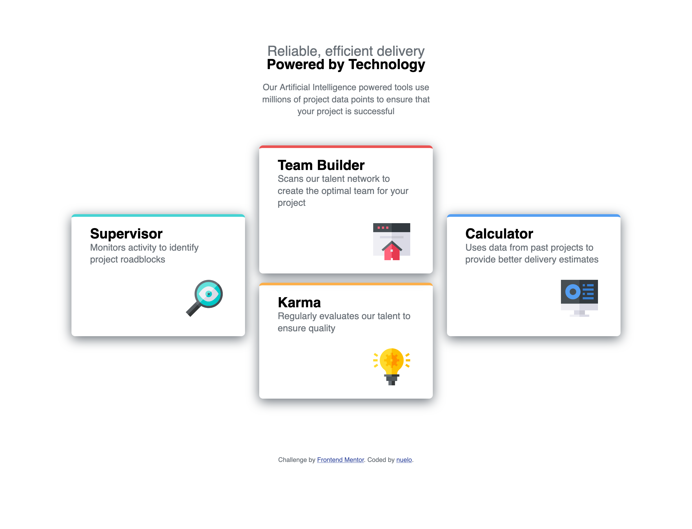

# Frontend Mentor - Four card feature section solution

This is a solution to the [Four card feature section challenge on Frontend Mentor](https://www.frontendmentor.io/challenges/four-card-feature-section-weK1eFYK). Frontend Mentor challenges help you improve your coding skills by building realistic projects. 

## Table of contents

- [Overview](#overview)
  - [The challenge](#the-challenge)
  - [Screenshot](#screenshot)
  - [Links](#links)
- [My process](#my-process)
  - [Built with](#built-with)
  - [What I learned](#what-i-learned)
  - [Continued development](#continued-development)
- [Author](#author)
- [Acknowledgments](#acknowledgments)

## Overview
This project enabled me to practice using grid layout to help structure a web page.

### The challenge

Users should be able to:

- View the optimal layout for the site depending on their device's screen size

### Screenshot

<fig>
  <figcaption>desktop view:</figcaption>
  
  <figcaption>mobile view:</figcaption>
  
</fig>


### Links

- Solution URL: [github url](https://github.com/NueloSE/fe-mentors/tree/main/four-card-feature-section-master)
- Live Site URL: [live site](https://four-card-ruby-zeta.vercel.app/)

## My process

Built with mobile first approach

### Built with

- Semantic HTML5 markup
- CSS custom properties
- Flexbox
- CSS Grid
- Mobile-first workflow

### What I learned
Improved my understanding of the grid system for page layout

```css

@media (min-width: 780px) {
    section {
        max-width: 1000px;
        margin: auto;
        display: grid;
        gap: 1rem;
        grid-template-columns: repeat(3, 1fr);
        grid-template-rows: repeat(5, auto);
    }
    article {
        margin: 0 auto;
    }
    .supervisor {
        grid-row: 2 / 4;
    }
    .team {
        grid-column: 2/ 3;
        grid-row: 1/span 2;
    }
    .karma {
        grid-column: 2/3;
        grid-row: 3 / span 2;
    }
    .cal {
        grid-row: 2/4;
    }
}
```

### Continued development

improve more on handling page layout using more complex grid layouts

## Author

- Frontend Mentor - [@nuelose](https://www.frontendmentor.io/profile/nuelose)
- Twitter - [@isnuelo](https://www.twitter.com/isnuelo)


## Acknowledgments
For putting out such challenges i say a big thank you to the Frontend mentors team.
