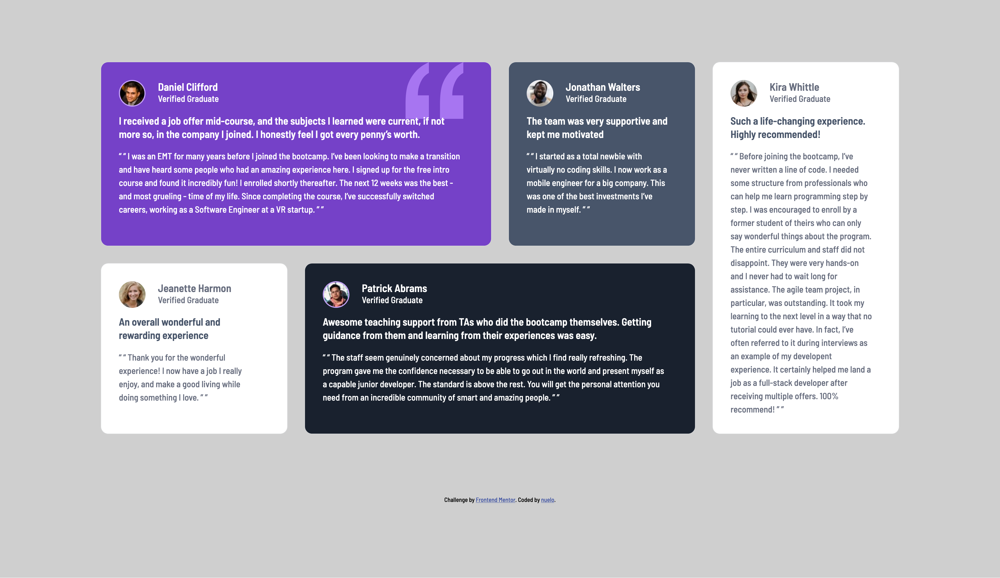
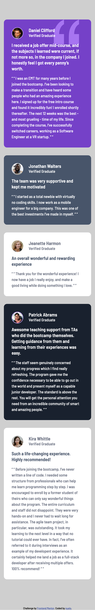

# Frontend Mentor - Testimonials grid section solution

This is a solution to the [Testimonials grid section challenge on Frontend Mentor](https://www.frontendmentor.io/challenges/testimonials-grid-section-Nnw6J7Un7). Frontend Mentor challenges help you improve your coding skills by building realistic projects. 

## Table of contents

- [Overview](#overview)
  - [The challenge](#the-challenge)
  - [Screenshot](#screenshot)
  - [Links](#links)
- [My process](#my-process)
  - [Built with](#built-with)
  - [What I learned](#what-i-learned)
  - [Continued development](#continued-development)
  - [Useful resources](#useful-resources)
- [Author](#author)
- [Acknowledgments](#acknowledgments)

## Overview

### The challenge

Users should be able to:

- View the optimal layout for the site depending on their device's screen size

### Screenshot

<figure>
  <figcaption>desktop view: </figcaptioni> 
  

  <figcaption>mobile view:</figcaptioin> 
  
</figure>

### Links

- Solution URL: [Add solution URL here](https://github.com/NueloSE/fe-mentors/tree/main/testimonials-grid-section-main)
- Live Site URL: [Add live site URL here](https://testimonial-card-delta-nine.vercel.app/)

## My process

### Built with

- Semantic HTML5 markup
- CSS custom properties
- CSS Grid
- Mobile-first workflow

### What I learned

indept understanding of the use of `grid` for proper item positioning in it's simplest form.

### Continued development

improve more on handling page layout using more complex grid layouts

## Author

- Frontend Mentor - [@nuelose](https://www.frontendmentor.io/profile/nuelose)
- Twitter - [@isnuelo](https://www.twitter.com/isnuelo)

## Acknowledgments
For putting out such great challenges i want to say  big thanks to the entire Frontend mentors team.
